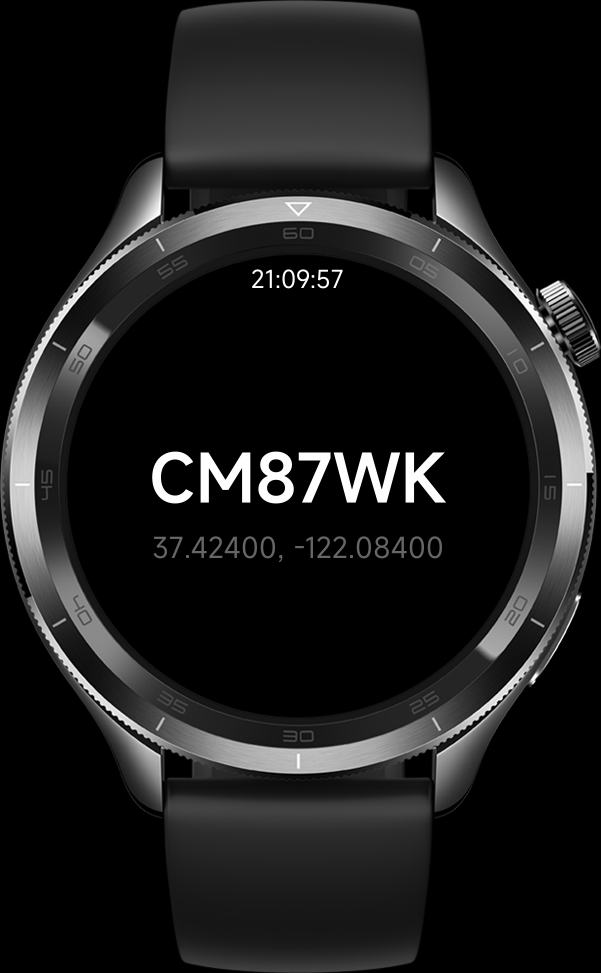

# Hrt位置 — 小米手表 Vela 地理位置快应用

[中文](#中文) ｜ [日本語](#日本語) ｜ [English](#english)

<div align="center">
  
</div>

## 中文

Hrt位置 是一款跑在小米手表 Vela 快应用平台上的小程序。手表戴在手上、天线在杆子上，
低头扫一眼手腕就能看到自己当前的 6 位梅登黑德网格号、经纬度和时间，不用掏手机。
它是 Android 端 [HamRadiotools](https://github.com/HaohanHe/HamRadiotools) 的手表端
配套；Hrt 取自 Ham Radio Tools 的首字母（包名 `com.Hamradiotools.watch.vela`）。

### 它做什么

- 用手表自带的 GPS 拿当前位置，把经纬度实时转成 6 位 Maidenhead 网格（Field A–R、
  Square 0–9、Block A–X），大字居中显示。
- 时间、经纬度（小数点后 5 位）作为辅助信息放在下方。
- 定位失败或 15 秒内拿不到坐标时，屏幕提示"卫星信号弱，请到开阔地带"。
- 前台运行时保持屏幕常亮，方便架台时瞄一眼。
- 界面文字目前只有中文。`src/i18n/` 下的三个 JSON 是工程模板自带的示例文件
  （内容还是 `{"a":{"b":"hello"}}` 这种占位），页面代码没有引用它们，不代表
  应用已经支持多语言。

### 实际实现细节

- 定位同时走两条路：`geolocation.subscribe` 2 秒一次的持续订阅，以及失败后
  指数退避的 `getLocation` 轮询（初始 5 秒，按 `5s × 2^retry` 递增，封顶 60 秒，
  加最多 500 ms 抖动），退避计数在拿到有效坐标后清零。
- 经纬坐标只有在字符串发生变化时才重算网格，避免无意义刷新。
- 错误码按 Vela 文档映射成中文提示：203 设备不支持定位、204 定位超时、
  400 权限被拒、402 未声明定位权限。
- 每 60 次 `getLocation` 成功会手动调一次 `global.runGC()` 触发 GC，控制手表上的
  内存占用（订阅回调不计入这个计数）。
- `onHide` / `onDestroy` 里停掉时钟、轮询定时器并退订定位，省电。

### 技术栈

- 小米快应用 Vela 平台，`.ux` 单文件组件，工具链是 `aiot-toolkit`（`aiot start` /
  `build` / `release`）。
- `package.json` 里 `engines.node >= 8.10`，构建依赖 `aiot-toolkit ^2.0.4` 与
  `@aiot-toolkit/jsc ^1.0.3`。
- `manifest.json`：包名 `com.Hamradiotools.watch.vela`，versionName `1.0.2`、
  versionCode `3`，`deviceTypeList` 仅 `watch`。
- 用到的系统能力：`system.router`、`system.geolocation`、`system.brightness`
  （`setKeepScreenOn`），权限 `hapjs.permission.LOCATION`。
- 工程配了 ESLint + Prettier + stylelint + commitlint + husky，提交前自动格式化。

### 目录结构

```
src/
├── app.ux              # 应用入口
├── config-watch.json    # 空的占位配置
├── manifest.json       # 快应用清单（包名 / 权限 / 路由）
├── common/
│   └── logo.png        # 应用图标
├── i18n/                # 模板自带的示例语言文件，页面未引用
│   ├── defaults.json
│   ├── en.json
│   └── zh-CN.json
└── pages/
    ├── index/
    │   └── index.ux    # 主页面：时钟 + 网格 + 经纬度
    └── detail/
        └── detail.ux   # 模板自带的示例页，未使用
```

### 开发、构建、发布

需要先装好 Node.js（≥ 8.10）和小米 Vela 快应用的调试环境 / 调试器。

```bash
npm install
npm run start -- --watch   # 起开发服务器，watch 模式
npm run build              # 出生产包
npm run release            # 发布到快应用平台
npm run lint               # ESLint 修复 src/ 下的 .ux / .js
```

首次使用 husky 钩子前，先在仓库根目录跑一次 `sh husky.sh`（Windows 用
`./husky.sh`），它会把 commit-msg / pre-commit 装好。

### 使用

1. 装到手表后打开，首次启动会请求定位权限，允许即可。
2. 顶部是当前时间，中间大字是 6 位网格号，下面一行是经纬度。
3. 在室内或者遮挡严重的地方 15 秒内拿不到定位，会提示去开阔地带。
4. 应用在前台时屏幕常亮，切到后台会停定时器和定位订阅。

### 截图

<div align="center">
  
</div>

### 相关项目

- Android 手机端：[HamRadiotools](https://github.com/HaohanHe/HamRadiotools)
- 小米 Vela 快应用官方文档：<https://iot.mi.com/vela/quickapp>

### 许可证

MIT License，详见 [LICENSE](LICENSE)。

---

## 日本語

Hrt位置 は Xiaomi スマートウォッチの Vela クイックアプリ（快应用）プラットフォーム
向けの小さなアプリです。アンテナを上げた現場で、スマホを取り出さなくても手首を
見るだけで 6 桁メイデンヘッド・ロケータ、緯度経度、時刻が確認できます。Android
版 [HamRadiotools](https://github.com/HaohanHe/HamRadiotools) のウォッチ側
コンパニオンです。Hrt は Ham Radio Tools の頭文字です（パッケージ名は
`com.Hamradiotools.watch.vela`）。

### できること

- ウォッチ内蔵の GPS で現在地を取得し、緯度経度を 6 桁メイデンヘッド
  （Field A–R、Square 0–9、Block A–X）にリアルタイム変換して大きな文字で中央
  表示します。
- 時刻と緯度経度（小数点以下 5 桁）は補助情報として下に並べます。
- 測位に失敗するか、15 秒以内に座標が取れないと「衛星信号が弱いです。見通しの
  良い場所へ移動してください」と画面に出します。
- フォアグラウンドで動いている間は画面を常時点灯させ、運用中に一目で見られる
  ようにします。
- UI の文言は今のところ中国語のみです。`src/i18n/` の3つの JSON はテンプレート
  付属のサンプルで（中身は `{"a":{"b":"hello"}}` というプレースホルダ）、
  ページからは参照されていません。多言語対応済みという意味ではありません。

### 実装メモ

- 測位は 2 系統を並行して使います。`geolocation.subscribe` による 2 秒間隔の
  継続購読と、失敗時に指数バックオフする `getLocation` ポーリング（初期 5 秒、
  `5s × 2^retry` で伸び、最大 60 秒、最大 500 ms のジッタ付き）で、有効な
  座標が取れたらリトライカウンタをリセットします。
- 緯度経度の文字列が変わったときだけロケータを再計算し、無駄な描画を避けて
  います。
- Vela のエラーコードをメッセージに対応付けています：203 端末が測位非対応、
  204 測位タイムアウト、400 権限拒否、402 測位権限未宣言。
- `getLocation` が60回成功するごとに `global.runGC()` を手動で呼び、ウォッチ上
  のメモリ使用を抑えます（購読コールバックはこの数に含めません）。
- `onHide` / `onDestroy` で時計とポーリングのタイマーを止め、測位購読を解除
  して電池を節約します。

### 技術構成

- Xiaomi Vela クイックアプリ、`.ux` シングルファイルコンポーネント。ツールチェーンは
  `aiot-toolkit`（`aiot start` / `build` / `release`）です。
- `package.json` の `engines.node >= 8.10`、ビルド依存は `aiot-toolkit ^2.0.4` と
  `@aiot-toolkit/jsc ^1.0.3` です。
- `manifest.json`：パッケージ名 `com.Hamradiotools.watch.vela`、versionName
  `1.0.2`、versionCode `3`、`deviceTypeList` は `watch` のみ。
- 使用システム能力：`system.router`、`system.geolocation`、`system.brightness`
  （`setKeepScreenOn`）、権限は `hapjs.permission.LOCATION`。
- ESLint + Prettier + stylelint + commitlint + husky を導入し、コミット前に自動
  整形します。

### ディレクトリ構成

```
src/
├── app.ux              # アプリエントリ
├── config-watch.json    # 空のプレースホルダ設定
├── manifest.json       # クイックアプリ定義（パッケージ名 / 権限 / ルート）
├── common/
│   └── logo.png        # アイコン
├── i18n/                # テンプレート付属のサンプル、ページから未参照
│   ├── defaults.json
│   ├── en.json
│   └── zh-CN.json
└── pages/
    ├── index/
    │   └── index.ux    # メイン画面：時計 + ロケータ + 緯度経度
    └── detail/
        └── detail.ux   # テンプレート付属のサンプルページ（未使用）
```

### 開発・ビルド・リリース

事前に Node.js（≥ 8.10）と Xiaomi Vela クイックアプリのデバッグ環境が必要です。

```bash
npm install
npm run start -- --watch   # 開発サーバ起動（watch モード）
npm run build              # 本番パッケージをビルド
npm run release            # クイックアプリプラットフォームへリリース
npm run lint               # ESLint で src/ 配下の .ux / .js を修正
```

husky フックを初めて使う前に、リポジトリルートで `sh husky.sh` を一度実行して
ください（Windows は `./husky.sh`）。commit-msg と pre-commit が仕込まれます。

### 使い方

1. ウォッチにインストールして起動すると、初回は位置情報の許可を求められます。
   許可してください。
2. 上部に現在時刻、中央の大きな文字に 6 桁ロケータ、その下に緯度経度が出ます。
3. 屋内や遮蔽物の多い場所では 15 秒以内に測位できないことがあり、見通しの
   良い場所へ移動するよう表示します。
4. アプリがフォアグラウンドの間は画面を点灯させたままにし、バックグラウンドで
   はタイマーと測位購読を停止します。

### スクリーンショット

<div align="center">
  
</div>

### 関連プロジェクト

- Android スマホ版：[HamRadiotools](https://github.com/HaohanHe/HamRadiotools)
- Xiaomi Vela クイックアプリ公式ドキュメント：<https://iot.mi.com/vela/quickapp>

### ライセンス

MIT License です。詳細は [LICENSE](LICENSE) を参照してください。

---

## English

Hrt位置 is a small quick app for Xiaomi watches running the Vela platform. With
the rig already in the field, you can glance at your wrist instead of pulling
out the phone: it shows your current 6-character Maidenhead locator, lat/lon,
and the time. It is the watch companion to the Android app
[HamRadiotools](https://github.com/HaohanHe/HamRadiotools). Hrt is short
for Ham Radio Tools (package name `com.Hamradiotools.watch.vela`).

### What it does

- Reads the watch GPS and converts the current lat/lon to a 6-character
  Maidenhead locator (Field A–R, Square 0–9, Block A–X), rendered large in
  the center.
- Shows the time and lat/lon (5 decimal places) as smaller auxiliary text.
- If the fix fails or no coordinates arrive within 15 seconds, it shows a
  "weak satellite signal, move to open sky" message.
- Keeps the screen on while in the foreground so you can read it without
  tapping, which matters while adjusting an antenna.
- The UI text is Chinese only for now. The three JSON files under
  `src/i18n/` came with the project template (they still hold
  `{"a":{"b":"hello"}}` placeholders) and no page imports them, so they do
  not mean the app is localized.

### Implementation notes

- Location runs on two tracks: a 2-second `geolocation.subscribe` stream, and
  a backoff-based `getLocation` polling loop. Backoff starts at 5 seconds,
  grows as `5s × 2^retry`, caps at 60 seconds, and adds up to 500 ms of
  jitter. The retry counter resets once a valid fix arrives.
- The locator is recomputed only when the lat/lon string actually changes, to
  avoid pointless redraws.
- Vela error codes are mapped to readable messages: 203 device does not
  support location, 204 location timeout, 400 permission denied,
  402 location permission not declared.
- Every 60 successful `getLocation` calls the code calls `global.runGC()` to
  keep memory pressure low on the watch (subscribe callbacks are not
  counted).
- `onHide` / `onDestroy` stop the clock and polling timers and unsubscribe
  from location to save battery.

### Stack

- Xiaomi Vela quick apps, `.ux` single-file components, toolchain is
  `aiot-toolkit` (`aiot start` / `build` / `release`).
- `package.json` requires Node `>= 8.10`. Build dependencies are
  `aiot-toolkit ^2.0.4` and `@aiot-toolkit/jsc ^1.0.3`.
- `manifest.json`: package `com.Hamradiotools.watch.vela`, versionName
  `1.0.2`, versionCode `3`, `deviceTypeList` is `["watch"]` only.
- System features used: `system.router`, `system.geolocation`,
  `system.brightness` (for `setKeepScreenOn`). Permission:
  `hapjs.permission.LOCATION`.
- The project wires up ESLint, Prettier, stylelint, commitlint, and husky so
  commits are auto-formatted and linted.

### Layout

```
src/
├── app.ux              # app entry
├── config-watch.json    # empty placeholder config
├── manifest.json       # quick app manifest (package / permissions / routes)
├── common/
│   └── logo.png        # app icon
├── i18n/                # template sample files, not referenced by pages
│   ├── defaults.json
│   ├── en.json
│   └── zh-CN.json
└── pages/
    ├── index/
    │   └── index.ux    # main screen: clock + locator + lat/lon
    └── detail/
        └── detail.ux   # scaffold sample page, not used
```

### Develop, build, release

You need Node.js (>= 8.10) and the Xiaomi Vela quick-app debug setup.

```bash
npm install
npm run start -- --watch   # dev server with watch mode
npm run build              # production build
npm run release            # publish to the quick-app platform
npm run lint               # ESLint --fix over .ux / .js in src/
```

Before the first commit, run `sh husky.sh` once at the repo root (on Windows:
`./husky.sh`) to install commit-msg and pre-commit hooks.

### Usage

1. Install on the watch and open it. On first launch it asks for location
   permission; allow it.
2. The top line is the time, the large center text is the 6-char locator, and
   the line below shows lat/lon.
3. Indoors or under heavy obstruction it may not get a fix within 15 seconds;
   it then prompts you to move to open sky.
4. While the app is in the foreground the screen stays on; in the background
   timers and the location subscription are stopped.

### Screenshot

<div align="center">
  
</div>

### See also

- Android phone app: [HamRadiotools](https://github.com/HaohanHe/HamRadiotools)
- Xiaomi Vela quick-app docs: <https://iot.mi.com/vela/quickapp>

### License

MIT License, see [LICENSE](LICENSE).
